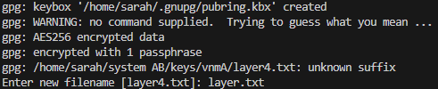

# Linux Strength Training - Решение

## Урок по многоуровневой дешифровке и GPG

### Поиск файла layer4.txt

```bash
find / -type f -name layer4.txt 2>/dev/null
```

Находим файл `layer4.txt` — он зашифрован с помощью GPG.

```bash
cat <path_to_file>/layer4.txt
```



---

### Расшифровка файла с помощью GPG

```bash
gpg <path_to_file>/layer4.txt
```

Пароль: `bob`


---

### Поиск файлов layer3.txt и layer2.txt

```bash
find / -type f -name layer3.txt 2>/dev/null
find / -type f -name layer2.txt 2>/dev/null
```

`layer2.txt` оказался закодирован в Base64.

---

### Декодирование layer2.txt

```bash
base64 -d decrypted_layer2.txt
```

---

### Поиск финального слоя layer1.txt

```bash
find / -type f -name layer1.txt 2>/dev/null
```

---

## Вывод

В этом задании мы научились:

1. Использовать `find` для поиска файлов в системе
2. Расшифровывать GPG-файлы
3. Декодировать данные в формате Base64
4. Работать с многослойной системой защиты информации

Мы успешно добрались до финального слоя и получили флаг, укрепив навыки работы с Linux и криптографией.