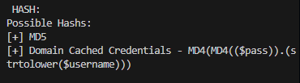
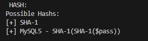

### Решение задания по взлому хэшей в комнате Linux Strength Training

#### Пункт 1: Установка John the Ripper и подготовка словаря
1. Устанавливаем `john` на локальную машину:
   ```bash
   sudo apt update && sudo apt install john -y
   ```
2. Проверяем наличие словаря `rockyou.txt`. Если его нет:
   ```bash
   sudo apt reinstall wordlists
   sudo gunzip /usr/share/wordlists/rockyou.txt.gz
   ```
3. Запускаем брутфорс хэша `hash1.txt`:
   ```bash
   john --format=RAW-MD5 --wordlist=/usr/share/wordlists/rockyou.txt hash1.txt
   ```

#### Пункт 2: Подключение к машине и работа с хэшами
1. Подключаемся по SSH:
   ```bash
   ssh sarah@10.10.*.*
   Пароль: rainbowtree1230x
   ```
2. Ищем файл `hashA.txt` и копируем его на локальную машину:
   ```bash
   find / -type f -name '*hashA.txt' 2>/dev/null
   scp sarah@10.10.*.*:/home/sarah/<file_path>/hashA.txt hashA.txt
   ```
3. Устанавливаем `hash-identifier` и определяем тип хэша:
   ```bash
   sudo apt install hash-identifier
   cat hashA.txt | hash-identifier
   ```
   
4. Взламываем хэш:
   ```bash
   john --format=RAW-MD4 --wordlist=/usr/share/wordlists/rockyou.txt hashA.txt
   ```

#### Пункт 3: Работа с hashB.txt
1. Ищем и копируем `hashB.txt`:
   ```bash
   find / -type f -name '*hashB.txt' 2>/dev/null
   scp sarah@10.10.*.*:/home/sarah/<file_path>/hashB.txt hashB.txt
   ```
2. Определяем тип хэша:
   ```bash
   cat hashB.txt | hash-identifier
   ```
   
3. Взламываем хэш:
   ```bash
   john --format=raw-sha1 --wordlist=/usr/share/wordlists/rockyou.txt hashB.txt
   ```

#### Пункт 4: Работа с hashC.txt и пользовательским словарем
1. Ищем файлы `ww.mnf` и `hashC.txt`, копируем их:
   ```bash
   find / -type f -name '*.mnf' 2>/dev/null
   find / -type f -name 'hashC.txt' 2>/dev/null
   scp sarah@10.10.*.*:/home/sarah/<file_path>/ww.mnf ww.mnf
   scp sarah@10.10.*.*:/home/sarah/<file_path>/hashC.txt hashC.txt
   ```
2. Определяем тип хэша и взламываем с помощью `ww.mnf`:
   ```bash
   cat hashC.txt | hash-identifier
   john --format=raw-sha256 --wordlist=ww.mnf hashC.txt
   ```

### Вывод
В ходе выполнения задания мы успешно взломали несколько хэшей, используя John the Ripper и различные методы (стандартный словарь `rockyou.txt` и пользовательский словарь `ww.mnf`). Были определены типы хэшей с помощью `hash-identifier`, что позволило правильно подобрать формат для `john`. Задание демонстрирует важность использования сложных паролей и уязвимость слабых хэшей перед атаками перебора.