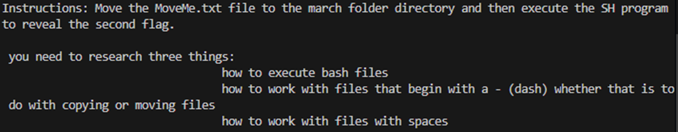

# TryHackMe: Linux Strength Training - Работа с файлами

## Поиск скрытого файла readME_hint.txt

``` bash
find ~ -type f -name readME_hint.txt
cat <file_path>/readME_hint.txt
```


## Поиск и перемещение скрытого файла MoveMe.txt

Задание казалось бы простое, но требует нескольких шагов:
1. Найти файл
2. Найти директорию
3. Переместить файл
4. Исполнить скрипт

Первая попытка найти файл не увенчалась успехом:

``` bash
find ~ -type f -name 'MoveMe.txt' 2>/dev/null
```
Файл не найден, но мы знаем, что он существует. Вероятно, имя файла начинается со специальных символов. Пробуем:

``` bash
find ~ -type f -name '*MoveMe.txt' 2>/dev/null
```
Теперь файл найден! Аналогично ищем директорию (не забываем про пробел в названии):

``` bash
find ~ -type d -name '*march\ folder' 2>/dev/null
```
## Перемещение файла и выполнение скрипта

Перемещаем файл в нужную директорию:

``` bash
mv <file_path>/-MoveMe.txt <directory_path>/-march\ folder
cd <directory_path>/-march\ folder
```
Проверяем содержимое папки:

``` bash
ls -la
```
Видим исполняемый файл `-runME.sh`. Запускаем его:

``` bash
./-runME.sh
```
**Флаг найден!**

## Выводы по работе с файлами

В ходе выполнения задания мы:
1. Освоили поиск скрытых файлов с использованием wildcard-символов (`*`)
2. Научились работать с файлами и директориями, содержащими:
   - Специальные символы в начале имен
   - Пробелы в названиях (требуют экранирования `\`)
3. Применили на практике:
   - Поиск файлов по шаблону (`find -name`)
   - Перемещение файлов между директориями (`mv`)
   - Запуск скриптов с нестандартными именами (`./-script.sh`)
4. Убедились в важности:
   - Проверки скрытых файлов (`ls -la`)
   - Обработки ошибок поиска (`2>/dev/null`)
